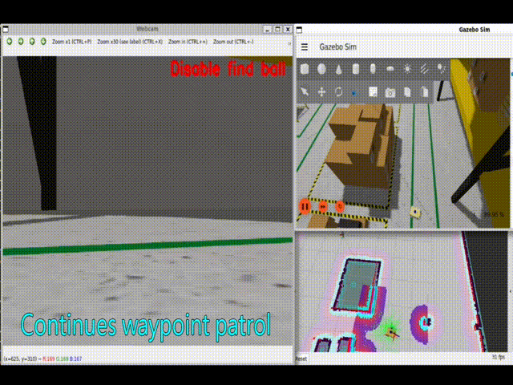
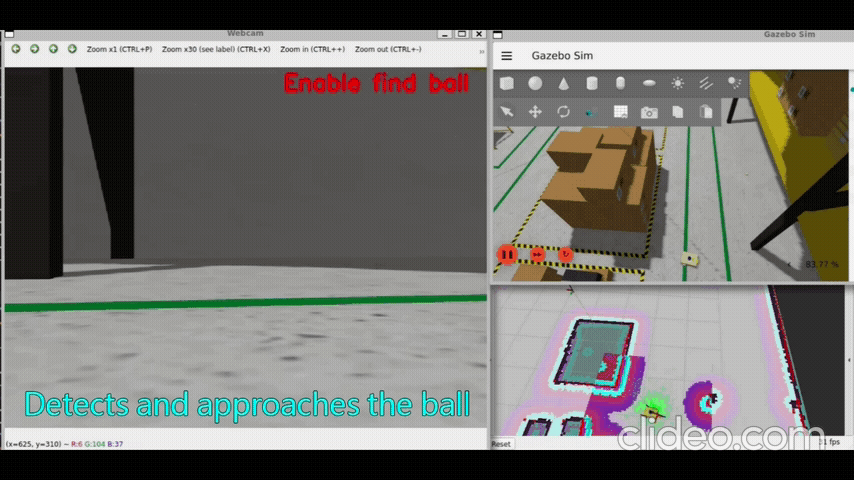
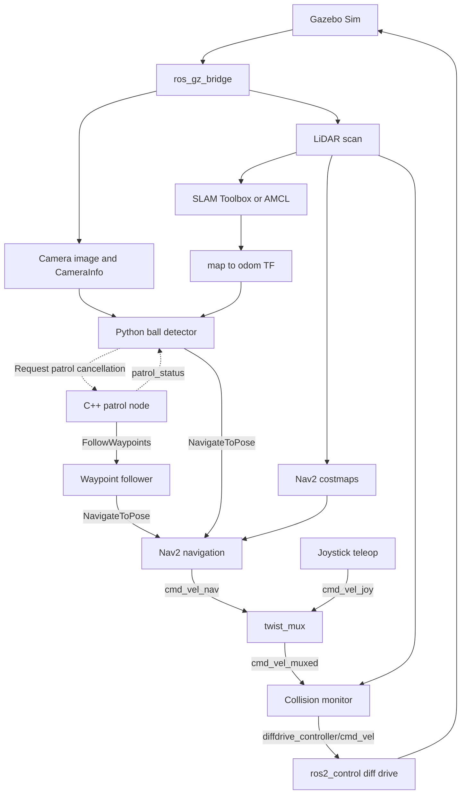

# Tennisbot — Autonomous Patrol & Vision-Guided Navigation

A ROS 2 differential-drive robot simulation that patrols a warehouse and switches to approaching a tennis ball when visual target handling is enabled.

Built as a personal robotics project, Tennisbot connects **robot modeling → base control → sensing → localization → navigation → visual target approach**. The application combines a custom C++ patrol node with a Python/OpenCV vision node and the Nav2 navigation stack.

**ROS 2 Jazzy · Gazebo Sim · Nav2 · ros2_control · C++ · Python · OpenCV**

## Demo: Find Ball OFF vs ON

The animations below compare waypoint patrol with Find Ball disabled and enabled.

### Find Ball OFF — continues patrol

The robot continues its waypoint task without switching to a ball-approach goal.

<p align="center">
  
</p>

### Find Ball ON — detects and approaches

A qualifying ball detection triggers patrol cancellation and navigation toward the estimated target position.

<p align="center">
  
</p>

Full recordings (MP4): [Download patrol demo](https://github.com/Will0103/tennisbot_ws/raw/refs/heads/master/docs/Continues_waypoint_patrol.mp4) · [Download visual-approach demo](https://github.com/Will0103/tennisbot_ws/raw/refs/heads/master/docs/Detects_and_approaches_the_ball.mp4).

Each recording combines three views:

- **Camera / OpenCV:** the simulated camera image, Find Ball state, and detection/range annotations when a candidate is accepted.
- **Gazebo:** the robot's movement in the warehouse.
- **RViz:** the robot pose, map, costmaps, and navigation path.

The visual-approach workflow is:

**Patrol → detect ball → cancel patrol → transform target into map coordinates → approach → request stop near the ball.**

These are simulation demonstrations of navigation and visual target approach. The project does not include a ball-collection mechanism.

## Features

| Area | Implementation |
| --- | --- |
| Robot modeling | URDF/Xacro differential-drive robot with collision and inertial properties, sensor links, and camera optical frame |
| Simulation and base control | Gazebo Sim, `gz_ros2_control`, joint state broadcaster, differential-drive controller, and wheel odometry |
| Sensors | LiDAR, IMU, RGB image, and CameraInfo bridged from Gazebo to ROS 2 |
| Mapping and localization | SLAM Toolbox for map creation; map server and AMCL for localization on a saved map |
| Navigation | SmacPlanner2D, SimpleSmoother, and Regulated Pure Pursuit connected through a custom behavior tree |
| Patrol | Custom C++ `FollowWaypoints` client, repeated patrol cycles, joystick start/cancel, and patrol-status publication |
| Vision and approach | Python/OpenCV HSV segmentation, contour filtering, monocular position estimation, TF transformation, and `NavigateToPose` requests |
| Manual intervention | Joystick deadman/turbo controls and higher-priority manual velocity input through `twist_mux` |
| Collision monitoring | Velocity-dependent stop polygons and a slowdown zone downstream of velocity arbitration |

The project includes a warehouse world with a saved map and a separate house world. The recorded demos use the warehouse.

## System architecture



The shared velocity-control launch starts joystick teleop, `twist_mux`, and collision monitor in both mapping and navigation modes. Manual velocity input has higher priority than autonomous input; taking over velocity control does not automatically cancel the navigation task.

**TF ownership**

```text
map → odom                         SLAM Toolbox or AMCL
odom → base_footprint               differential-drive controller
base_footprint → base_link          robot_state_publisher
base_link → wheels and sensors     robot_state_publisher
camera_link → camera_optical_link   robot_state_publisher
```

IMU data is available as a ROS topic, but the current system does not fuse it into wheel odometry.

## From camera detection to a navigation goal

1. Read the RGB image and camera intrinsics from `CameraInfo`.
2. Combine HSV color masks, apply morphological closing, and check the largest contour's area and circularity.
3. Estimate the ball's optical-frame position from its assumed **67 mm diameter** and image size:

   ```text
   Z = fx × ball_diameter / pixel_diameter
   X = (u − cx) × Z / fx
   Y = (v − cy) × Z / fy
   ```

4. After three consecutive qualifying detections, request patrol cancellation. Use `/patrol_status` to wait until patrol is reported inactive before sending an approach goal.
5. Transform the observed point from `camera_optical_link` to `map` at the image timestamp and send a `NavigateToPose` request.
6. Request cancellation of the approach when the observed optical depth drops below **0.3 m**.

The detector uses classical computer vision and known-size geometry. The three-frame threshold filters brief detections; it does not establish object identity across frames. Distance is an estimate relative to the camera, rather than a measured clearance from the robot's outer surface.

## Repository structure

| Location | Responsibility |
| --- | --- |
| `src/tennisbot_bringup` | Top-level simulation launch and mode selection |
| `src/tennisbot_description` | URDF/Xacro, sensors, Gazebo worlds/assets, and RViz configurations |
| `src/tennisbot_controller` | Base controller, joystick configuration, mux, and shared collision-monitor launch |
| `src/tennisbot_mapping` | SLAM configuration and saved warehouse map |
| `src/tennisbot_localization` | Map server and AMCL |
| `src/tennisbot_navigation` | Nav2 configuration, behavior tree, and C++ patrol node |
| `src/tennisbot_vision` | ROS 2 Python detection and approach node |
| `src/OpenCV_files` | Standalone webcam experiments and HSV tuner |
| `docs` | Animated demo comparisons and full MP4 recordings |

## Build and run

### Requirements

- Linux with ROS 2 Jazzy and compatible Gazebo Sim packages.
- `ros_gz_sim`, `ros_gz_bridge`, `gz_ros2_control`, `ros2_controllers`, `xacro`, robot state publisher, and RViz.
- Nav2 with the configured Smac planner, RPP controller, smoother, waypoint follower, and collision monitor; SLAM Toolbox.
- `joy`, `teleop_twist_joy`, and `twist_mux` with stamped-velocity support.
- Python OpenCV, NumPy, `cv_bridge`, and ROS 2 TF libraries.
- A gamepad and graphical desktop for Gazebo, RViz, and the OpenCV display.

Install these components before building; the package manifests do not yet list every runtime dependency.

### Build

```bash
source /opt/ros/jazzy/setup.bash
git clone https://github.com/Will0103/tennisbot_ws.git
cd tennisbot_ws
colcon build --symlink-install
source install/setup.bash
```

### Run the navigation demo

```bash
ros2 launch tennisbot_bringup robot_simulation.launch.py
```

The default launch starts the warehouse simulation, shared base/velocity control, saved map, AMCL, Nav2, patrol node, vision node, and RViz. **Find Ball starts disabled.** Wait for initialization and check the map alignment before starting patrol.

| Gamepad button index | Function |
| --- | --- |
| Hold `4` | Normal manual driving |
| Hold `5` | Turbo manual driving |
| Press `3` | Start/resume waypoint patrol |
| Press `2` | Cancel patrol |
| Press `7` | Toggle Find Ball; disabling requests cancellation of an accepted approach goal |

Indices are zero-based and may differ across gamepads. Verify `/joy` for your controller. Button `2` cancels patrol; the old standalone node for canceling arbitrary navigation goals is not enabled.

**To reproduce the comparison:**

1. Start patrol with Find Ball disabled to observe the waypoint-following behavior.
2. During a patrol run, enable Find Ball and let a ball enter the camera's view.
3. Observe detection annotations, the change in navigation path, and the approach.
4. To begin another search after an approach, disable Find Ball, wait for the action to finish, restart patrol, and enable Find Ball again. Patrol resumption is currently manual.

### Run SLAM mapping

```bash
ros2 launch tennisbot_bringup robot_simulation.launch.py use_slam:=true
```

Drive through the environment with the gamepad. Mapping mode starts SLAM and the shared velocity-control chain; AMCL, autonomous patrol, and the vision application are disabled.

Save the map from another terminal with the workspace sourced:

```bash
ros2 run nav2_map_server map_saver_cli -f warehouse_map --ros-args -p use_sim_time:=true
```

### Main configuration files

| Setting | File |
| --- | --- |
| Patrol coordinates and buttons | [navigation.launch.py](src/tennisbot_navigation/launch/navigation.launch.py) |
| Path tracking and local costmap | [controller_server.yaml](src/tennisbot_navigation/config/controller_server.yaml) |
| Global planning and costmap | [planner_server.yaml](src/tennisbot_navigation/config/planner_server.yaml) |
| Navigation behavior tree | [smooth_navigation.xml](src/tennisbot_navigation/behavior_tree/smooth_navigation.xml) |
| Collision stop/slowdown regions | [collision_monitor.yaml](src/tennisbot_navigation/config/collision_monitor.yaml) |
| Joystick mapping / velocity priority | [teleop_twist_joy.yaml](src/tennisbot_controller/config/teleop_twist_joy.yaml) / [twist_mux.yaml](src/tennisbot_controller/config/twist_mux.yaml) |
| Vision thresholds and approach logic | [ball_detector.py](src/tennisbot_vision/tennisbot_vision/ball_detector.py) |
| Test-ball placement | [small_warehouse.world](src/tennisbot_description/worlds/small_warehouse.world) |

## Current scope and next steps

The recorded demos show the integrated patrol and visual-approach workflow in simulation. Detection is tuned for the warehouse scene and known ball size. Hardware validation, ball collection, multi-object tracking, and automatic patrol resumption are outside the current implementation.

Further work focuses on navigation and approach tuning across different target placements, easier environment setup, and eventual deployment on a physical robot.

## Author

Will Hsu — [GitHub](https://github.com/Will0103)

Built with ROS 2, Gazebo, Nav2, ros2_control, SLAM Toolbox, and OpenCV. The project's custom C++ and Python nodes connect these tools into an autonomous patrol and visual-target application.
