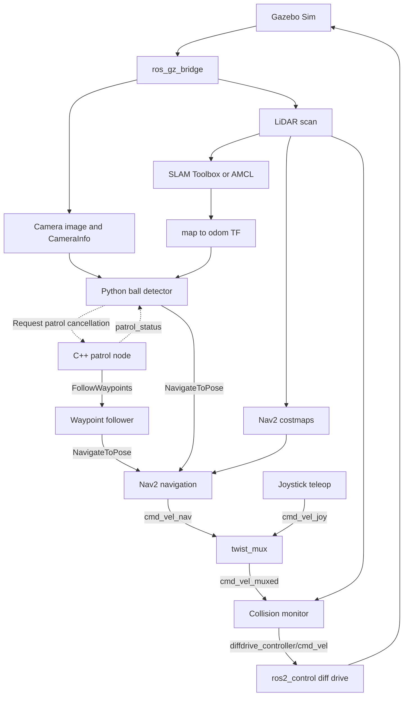

# Tennisbot — ROS 2 Autonomous Patrol & Vision-Guided Navigation

A differential-drive robot simulation that patrols a warehouse, detects a tennis ball with an RGB camera, and switches from waypoint patrol to navigating toward the detected target.

This personal project connects **robot modeling, control, mapping, localization, autonomous navigation, and computer vision** in a ROS 2 workspace. It focuses on understanding and integrating a complete robotics application in simulation.

**Platform:** ROS 2 Jazzy · Gazebo Sim · Nav2 · ros2_control · C++ · Python · OpenCV

## Demo

The main demonstration follows this sequence:

**Waypoint patrol → ball detection → patrol cancellation → target localization in the map → approach and stop.**

Gazebo shows the robot and environment, RViz shows localization and navigation paths, and the OpenCV window shows the detected ball and estimated distance.

<!-- After recording, replace this comment with your uploaded video URL or a linked preview image. -->

## Highlights

- **Robot and simulation:** URDF/Xacro differential-drive model with collision and inertial properties, Gazebo worlds, LiDAR, IMU, and RGB camera.
- **Base control:** `gz_ros2_control`, joint state broadcaster, and a differential-drive controller with wheel odometry.
- **Mapping and localization:** SLAM Toolbox for map creation; map server and AMCL for navigation on a saved map.
- **Navigation:** SmacPlanner2D, SimpleSmoother, and Regulated Pure Pursuit connected through a custom behavior tree.
- **Autonomous patrol:** a custom C++ `FollowWaypoints` client with joystick start/cancel controls and repeated patrol cycles.
- **Visual target approach:** a Python/OpenCV node detects ball candidates, estimates their position, transforms the result into `map`, and sends a `NavigateToPose` goal.
- **Manual control and collision monitoring:** joystick velocity commands have higher priority than navigation commands; both pass through collision monitor before reaching the base controller.

## System architecture



The shared velocity-control launch starts joystick teleop, `twist_mux`, and collision monitor in both mapping and navigation modes.

**TF chain**

```text
map → odom → base_footprint → base_link → camera_link → camera_optical_link
                                      ├→ laser_link
                                      └→ IMU_link
```

SLAM Toolbox or AMCL provides `map → odom`; the differential-drive controller provides `odom → base_footprint`; robot state publisher provides the robot's link transforms. IMU data is bridged into ROS 2 but is not currently fused into the odometry estimate.

## How visual approach works

1. Read the camera image and intrinsics from `CameraInfo`.
2. Apply HSV color segmentation and morphological closing; filter the largest contour by area and circularity.
3. Estimate the ball's position using its assumed **67 mm diameter** and pixel size:

   ```text
   Z = fx × ball_diameter / pixel_diameter
   X = (u − cx) × Z / fx
   Y = (v − cy) × Z / fy
   ```

4. After three consecutive qualifying detections, request patrol cancellation. The vision node uses `/patrol_status` to wait until patrol is reported inactive before sending an approach goal.
5. Transform the observed point from `camera_optical_link` to `map` using the image timestamp, then request navigation to the estimated position.
6. Request approach cancellation when the observed optical depth falls below **0.3 m**.

This uses classical computer vision and monocular geometry. The three-frame threshold filters brief detections; it does not implement object identity tracking across frames. The 0.3 m threshold is camera-relative optical depth, not a measured clearance from the robot's outer surface.

## Packages

| Package | Responsibility |
| --- | --- |
| `tennisbot_bringup` | Top-level launch and SLAM/navigation mode selection |
| `tennisbot_description` | URDF/Xacro, Gazebo sensor plugins, worlds, assets, and RViz configurations |
| `tennisbot_controller` | Differential-drive configuration, joystick teleop, velocity arbitration, and shared collision-monitor launch |
| `tennisbot_mapping` | SLAM configuration and saved warehouse map |
| `tennisbot_localization` | Map server and AMCL |
| `tennisbot_navigation` | Nav2 configuration, custom behavior tree, and C++ patrol node |
| `tennisbot_vision` | Ball detection, position estimation, and target-approach action client |

`src/OpenCV_files/` contains standalone webcam experiments and an HSV tuning tool.

## Build and run

### Requirements

- A Linux environment with ROS 2 Jazzy and compatible Gazebo Sim packages.
- `ros_gz_sim`, `ros_gz_bridge`, `gz_ros2_control`, `ros2_controllers`, `xacro`, robot state publisher, and RViz.
- Nav2, including the configured Smac planner, RPP controller, smoother, waypoint follower, and collision monitor; SLAM Toolbox.
- `joy`, `teleop_twist_joy`, and `twist_mux` with support for stamped velocity commands.
- Python OpenCV, NumPy, `cv_bridge`, and ROS 2 TF libraries.
- A gamepad and graphical desktop for the current Gazebo/RViz/OpenCV demonstration.

The package manifests do not yet describe every runtime dependency, so install the components above before building.

### Build

```bash
source /opt/ros/jazzy/setup.bash
git clone https://github.com/Will0103/tennisbot_ws.git
cd tennisbot_ws
colcon build --symlink-install
source install/setup.bash
```

### Navigation and ball approach

```bash
ros2 launch tennisbot_bringup robot_simulation.launch.py
```

This starts the warehouse simulation, base control, joystick/mux/collision monitor, saved map, AMCL, Nav2, patrol node, vision node, and RViz. Ball approach is initially disabled.

| Gamepad button index | Function |
| --- | --- |
| Hold `4` | Normal manual driving |
| Hold `5` | Turbo manual driving |
| Press `3` | Start/resume waypoint patrol |
| Press `2` | Cancel patrol |
| Press `7` | Toggle ball approach; disabling also requests cancellation of an accepted approach goal |

Button indices are zero-based; verify them for your controller using `/joy`. The old standalone navigation-cancel node is not enabled in the current launch. Manual velocity priority does not automatically cancel an autonomous task.

For a demonstration, wait for initialization, start patrol, then enable ball approach. After completing an approach, disable ball approach before restarting patrol; enable it again when starting the next search. Patrol does not automatically resume after approach completion.

### SLAM mapping

```bash
ros2 launch tennisbot_bringup robot_simulation.launch.py use_slam:=true
```

Drive through the environment with the gamepad. This mode starts SLAM and the shared velocity-control chain, while leaving AMCL, Nav2 patrol, and the vision application disabled.

Save the map from another terminal with the workspace sourced:

```bash
ros2 run nav2_map_server map_saver_cli -f warehouse_map --ros-args -p use_sim_time:=true
```

### Configuration entry points

| Change | File |
| --- | --- |
| Patrol coordinates and buttons | `src/tennisbot_navigation/launch/navigation.launch.py` |
| Controller and costmaps | `src/tennisbot_navigation/config/controller_server.yaml` and `planner_server.yaml` |
| Stop/slowdown regions | `src/tennisbot_navigation/config/collision_monitor.yaml` |
| Joystick mappings and velocity priority | `src/tennisbot_controller/config/teleop_twist_joy.yaml` and `twist_mux.yaml` |
| Detection thresholds and approach distance | `src/tennisbot_vision/tennisbot_vision/ball_detector.py` |
| Test-ball placement | `src/tennisbot_description/worlds/small_warehouse.world` |

## Project scope and next steps

This is a **simulation demonstration** of robot navigation and visual target approach. It does not include a collection mechanism or physical-robot validation. Vision is tuned for the demo environment and known ball size; multi-object tracking and automatic patrol resumption are future extensions.

Next steps include recording the integrated demo, improving approach behavior across different ball placements, and extending the system to a physical platform.

## Author

Will Hsu — [GitHub](https://github.com/Will0103)

Built with ROS 2, Gazebo, Nav2, ros2_control, SLAM Toolbox, and OpenCV. The custom application code connects these tools into the patrol and visual-approach workflow.
