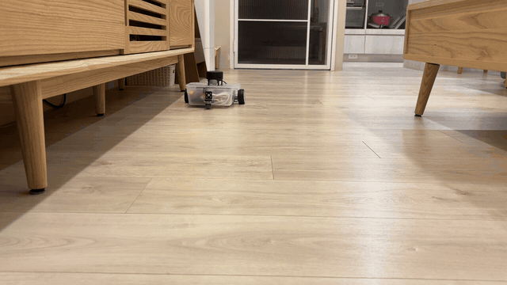
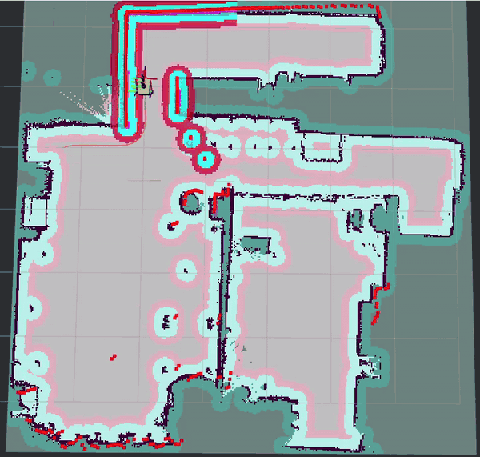
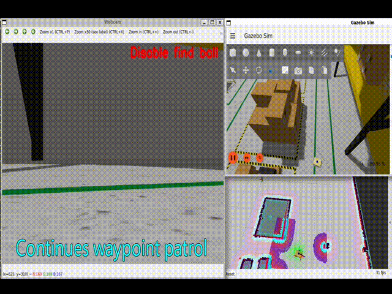
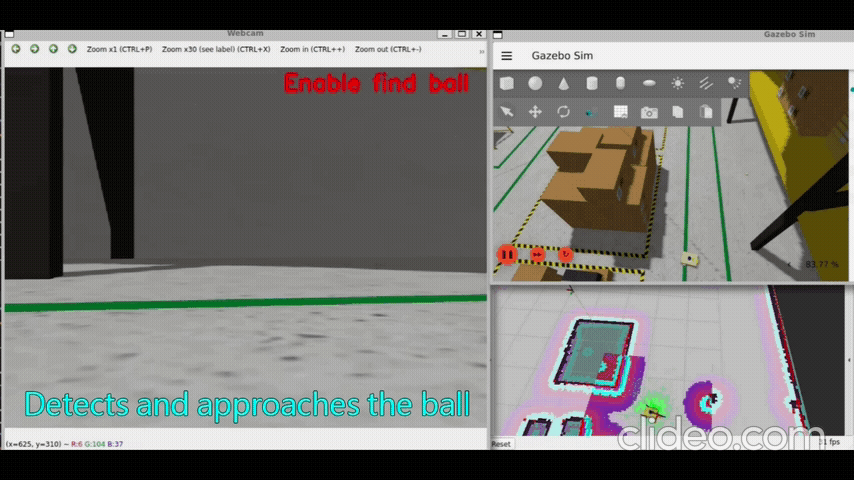
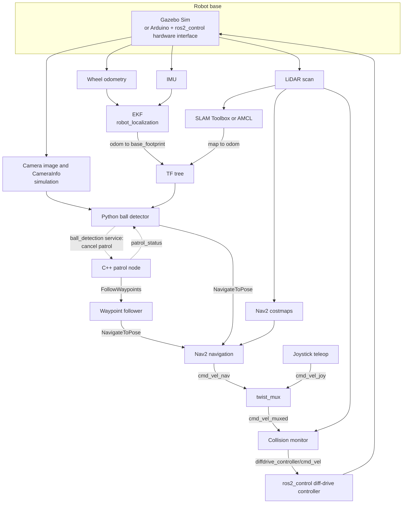

# Tennisbot — Autonomous Patrol & Vision-Guided Navigation

A differential-drive robot built from scratch with ROS 2 Jazzy. It runs both in **Gazebo simulation** and on a **physical robot**. It maps its environment, localizes itself, patrols a set of waypoints autonomously, and, in simulation, detects a tennis ball with OpenCV and drives to it.

The project covers the full robotics stack: **robot modeling → embedded motor control → sensing → sensor fusion → mapping and localization → navigation → visual target approach**. Custom C++ and Python nodes connect these pieces to Nav2, SLAM Toolbox, and ros2_control.

**ROS 2 Jazzy · Nav2 · SLAM Toolbox · ros2_control · robot_localization (EKF) · Gazebo Sim · OpenCV · C++ · Python · Arduino**

## Status at a glance

| Capability | Simulation | Physical robot |
| --- | --- | --- |
| SLAM mapping | Done | Done (home environment) |
| AMCL localization + EKF odometry | Done | Done |
| Nav2 navigation | Done | Running; costmap and collision-monitor tuning in progress |
| Autonomous waypoint patrol | Done | Done |
| OpenCV ball detection and approach | Done | Next milestone |

## Demos

### Physical robot — autonomous waypoint patrol at home

The robot runs autonomous waypoint patrol on a SLAM map of a home environment, with no joystick input. The left clip shows the robot at real speed; the right clip is an RViz recording of a separate patrol run at 5× speed, showing the map, laser scan, AMCL particle cloud, and costmaps as the robot moves.

| Robot (real speed) | RViz (5× speed) |
| --- | --- |
|  |  |

### Simulation — Find Ball OFF vs ON

With Find Ball disabled, the robot keeps following its patrol waypoints. With Find Ball enabled, a qualifying detection cancels the patrol and sends the robot toward the ball's estimated position.

| Find Ball OFF — continues patrol | Find Ball ON — detects and approaches |
| --- | --- |
|  |  |

Full simulation recordings (MP4): [patrol demo](https://github.com/Will0103/tennisbot_ws/raw/refs/heads/master/docs/Continues_waypoint_patrol.mp4) · [visual-approach demo](https://github.com/Will0103/tennisbot_ws/raw/refs/heads/master/docs/Detects_and_approaches_the_ball.mp4). Each recording shows three synchronized views: the camera image with OpenCV annotations, the robot in Gazebo, and RViz with the map, costmaps, and planned path.

The visual-approach workflow is:

**Patrol → detect ball → cancel patrol → transform target into map coordinates → approach → stop near the ball.**

The project does not yet include a ball-collection mechanism.

## Physical robot

| Component | Implementation |
| --- | --- |
| Drive base | Two DC motors with encoders, L298N motor driver, wheel radius 31.5 mm, wheel separation 221.2 mm |
| Motor controller firmware | Arduino sketch ([`robot_control_safe.ino`](src/tennisbot_firmware/firmware/robot_control_safe/robot_control_safe.ino)): interrupt-based encoder counting, per-wheel PID velocity loop at 10 Hz, and a 500 ms command watchdog that stops the motors if the serial link goes quiet |
| ROS 2 hardware interface | Custom C++ `ros2_control` `SystemInterface` plugin ([`tennisbot_interface.cpp`](src/tennisbot_firmware/src/tennisbot_interface.cpp)) that sends wheel velocity commands and reads encoder feedback over USB serial (115200 baud) |
| IMU | MPU6050 over I²C, read by a custom Python driver ([`mpu6050_driver.py`](src/tennisbot_firmware/tennisbot_firmware/mpu6050_driver.py)) with bias compensation, published at 100 Hz |
| LiDAR | SLAMTEC RPLidar A1 through `rplidar_ros` |
| Odometry fusion | `robot_localization` EKF fusing wheel-odometry forward velocity and yaw rate with IMU yaw rate; publishes `odom → base_footprint` at 50 Hz |
| Compute | Onboard Linux computer running the full ROS 2 stack (drivers, localization, Nav2, patrol) |

The serial protocol between the hardware interface and the Arduino is plain text, one line per cycle, with wheel speeds in rad/s. The sign is encoded as `p` (positive) or `n` (negative), for example `rp05.00,ln03.20,`. The Arduino replies with measured wheel velocities in the same format.

## Software features

| Area | Implementation |
| --- | --- |
| Robot modeling | URDF/Xacro differential-drive robot with collision and inertial properties, sensor links, and a camera optical frame; one model switches between Gazebo and real hardware (`is_sim`) |
| Base control | `ros2_control` diff-drive controller with velocity and acceleration limits; `gz_ros2_control` in simulation, the custom Arduino interface on hardware |
| Mapping and localization | SLAM Toolbox for map creation; map server and AMCL on a saved map; EKF for smoothed odometry |
| Navigation | Nav2 with SmacPlanner2D, SimpleSmoother, and Regulated Pure Pursuit, connected through a custom behavior tree |
| Patrol | Custom C++ `FollowWaypoints` client: loops through waypoints continuously, computes each waypoint's heading toward the next one, resumes from the current waypoint, supports joystick start/cancel, and publishes `patrol_status` |
| Vision and approach | Python/OpenCV node: HSV segmentation, morphological closing, contour area and circularity checks, monocular position estimate from known ball size, TF transform to the map, and a `NavigateToPose` goal |
| Manual override | Joystick deadman and turbo buttons; `twist_mux` gives manual input priority over autonomous commands |
| Collision monitoring | Nav2 collision monitor after velocity arbitration: direction-dependent stop polygons (forward, backward, rotation) plus a slowdown zone |

## System architecture


```mermaid
flowchart TD
    subgraph Base[Robot base]
        HW[Gazebo Sim<br/>or Arduino + ros2_control hardware interface]
    end

    HW --> ODOM[Wheel odometry]
    HW --> IMU[IMU]
    HW --> L[LiDAR scan]
    HW --> C[Camera image and CameraInfo<br/>simulation]

    ODOM --> EKF[EKF<br/>robot_localization]
    IMU --> EKF
    EKF -->|odom to base_footprint| TF[TF tree]
    L --> LOC[SLAM Toolbox or AMCL]
    LOC -->|map to odom| TF
    L --> COST[Nav2 costmaps]

    P[C++ patrol node] -->|FollowWaypoints| W[Waypoint follower]
    W -->|NavigateToPose| NAV[Nav2 navigation]
    C --> V[Python ball detector]
    TF --> V
    V -.->|ball_detection service:<br/>cancel patrol| P
    P -.->|patrol_status| V
    V -->|NavigateToPose| NAV
    COST --> NAV

    NAV -->|cmd_vel_nav| M[twist_mux]
    J[Joystick teleop] -->|cmd_vel_joy| M
    M -->|cmd_vel_muxed| CM[Collision monitor]
    L --> CM
    CM -->|diffdrive_controller/cmd_vel| D[ros2_control diff-drive controller]
    D --> HW
```

Manual velocity input has higher priority than autonomous input. Taking over with the joystick does not cancel the active navigation task by itself.

**TF ownership**

```text
map → odom                         SLAM Toolbox or AMCL
odom → base_footprint              EKF (robot_localization)
base_footprint → base_link         robot_state_publisher
base_link → wheels and sensors     robot_state_publisher
camera_link → camera_optical_link  robot_state_publisher
```

## From camera detection to a navigation goal

1. Read the RGB image and the camera intrinsics from `CameraInfo`.
2. Combine two HSV color masks, apply morphological closing, and check the largest contour's area (> 100 px) and circularity (> 0.6).
3. Estimate the ball's position in the camera optical frame from its known **67 mm diameter**:

   ```text
   Z = fx × ball_diameter / pixel_diameter
   X = (u − cx) × Z / fx
   Y = (v − cy) × Z / fy
   ```

4. After three consecutive qualifying frames, call the `ball_detection` service to cancel the patrol. Wait until `/patrol_status` reports that the patrol is inactive.
5. Transform the point from `camera_optical_link` to `map` at the image timestamp and send a `NavigateToPose` goal.
6. Cancel the approach when the estimated depth drops below **0.3 m**.

The detector uses classical computer vision and known-size geometry. The three-frame threshold filters out brief false detections; it does not track object identity across frames. The distance is estimated from the camera, not measured from the robot's outer edge.

## Repository structure

| Location | Responsibility |
| --- | --- |
| `src/tennisbot_bringup` | Top-level launch files for simulation and the physical robot; LiDAR configuration |
| `src/tennisbot_description` | URDF/Xacro, sensors, Gazebo worlds and assets, RViz configurations |
| `src/tennisbot_firmware` | Arduino firmware, C++ `ros2_control` hardware interface, MPU6050 driver |
| `src/tennisbot_controller` | Diff-drive controller, joystick configuration, `twist_mux`, collision-monitor launch (simulation and hardware variants) |
| `src/tennisbot_mapping` | SLAM configuration and saved maps (`small_warehouse`, `will_home`) |
| `src/tennisbot_localization` | Map server, AMCL, and EKF |
| `src/tennisbot_navigation` | Nav2 configuration, behavior tree, and C++ patrol node |
| `src/tennisbot_vision` | ROS 2 Python ball detection and approach node |
| `src/OpenCV_files` | Standalone webcam experiments and an HSV tuner |
| `rviz_temp` | RViz layouts for the physical robot |
| `docs` | Demo GIFs and full MP4 recordings |

## Build

```bash
source /opt/ros/jazzy/setup.bash
git clone https://github.com/Will0103/tennisbot_ws.git
cd tennisbot_ws
colcon build --symlink-install
source install/setup.bash
```

**Common requirements:** ROS 2 Jazzy, Nav2 (Smac planner, RPP controller, smoother, waypoint follower, collision monitor), SLAM Toolbox, `robot_localization`, `ros2_control` and `ros2_controllers`, `xacro`, `joy` / `joy_linux`, `teleop_twist_joy`, and `twist_mux` with stamped-velocity support.

**Simulation:** Gazebo Sim, `ros_gz_sim`, `ros_gz_bridge`, `gz_ros2_control`, Python OpenCV, NumPy, and `cv_bridge`.

**Physical robot:** `rplidar_ros`, LibSerial (for the hardware interface), `python3-smbus` (for the IMU driver), and the Arduino `PID_v1` library for the firmware.

The package manifests do not yet list every runtime dependency, so install these before building.

## Run in simulation

### Navigation, patrol, and Find Ball

```bash
ros2 launch tennisbot_bringup robot_simulation.launch.py
```

This starts the warehouse simulation, base and velocity control, EKF, saved map, AMCL, Nav2, the patrol node, the vision node, and RViz. **Find Ball starts disabled.** Wait for initialization and check that the robot is aligned with the map before starting patrol.

| Gamepad button | Function |
| --- | --- |
| Hold `4` | Manual driving |
| Hold `5` | Turbo manual driving |
| Press `3` | Start or resume patrol |
| Press `2` | Cancel patrol |
| Press `7` | Toggle Find Ball; disabling it also cancels an accepted approach goal |

Button indices are zero-based and may differ between gamepads. Check `/joy` for your controller.

To reproduce the Find Ball comparison:

1. Start patrol with Find Ball disabled and watch the waypoint-following behavior.
2. During patrol, enable Find Ball and let a ball enter the camera's view.
3. Watch the detection overlay, the change in the planned path, and the approach.
4. To search again, disable Find Ball, wait for the approach to finish, restart patrol, and enable Find Ball again. Patrol does not yet resume automatically.

### SLAM mapping

```bash
ros2 launch tennisbot_bringup robot_simulation.launch.py use_slam:=true
```

Drive through the environment with the gamepad. Mapping mode starts SLAM and the velocity-control chain; AMCL, patrol, and vision are disabled. Save the map from another terminal:

```bash
ros2 run nav2_map_server map_saver_cli -f warehouse_map --ros-args -p use_sim_time:=true
```

## Run on the physical robot

1. Flash [`robot_control_safe.ino`](src/tennisbot_firmware/firmware/robot_control_safe/robot_control_safe.ino) to the Arduino. [`encoder_test.ino`](src/tennisbot_firmware/firmware/encoder_test/encoder_test.ino) is available for checking the encoders first.
2. Update the serial port paths for your devices: the Arduino port in [`tennisbot_ros2_control.xacro`](src/tennisbot_description/urdf/tennisbot_ros2_control.xacro) and the LiDAR port in [`rplidar_a1.yaml`](src/tennisbot_bringup/config/rplidar_a1.yaml). Both use `/dev/serial/by-id/...` paths so they stay stable across reboots.
3. Launch navigation and patrol on the saved home map:

   ```bash
   ros2 launch tennisbot_bringup real_robot.launch.py
   ```

   To build a new map instead:

   ```bash
   ros2 launch tennisbot_bringup real_robot.launch.py use_slam:=true
   ```

4. Open RViz with a layout from `rviz_temp/` to watch the map, laser scan, costmaps, and collision-monitor polygons.

| Gamepad button | Function |
| --- | --- |
| Hold `4` | Manual driving |
| Hold `5` | Turbo manual driving |
| Press `3` | Start or resume patrol |
| Press `1` | Cancel patrol |

The home patrol route (9 waypoints) is defined in [`real_robot.launch.py`](src/tennisbot_bringup/launch/real_robot.launch.py).

## Main configuration files

| Setting | File |
| --- | --- |
| Simulation patrol waypoints and buttons | [robot_simulation.launch.py](src/tennisbot_bringup/launch/robot_simulation.launch.py) |
| Hardware patrol waypoints and buttons | [real_robot.launch.py](src/tennisbot_bringup/launch/real_robot.launch.py) |
| Wheel geometry and velocity limits | [tennisbot_controllers.yaml](src/tennisbot_controller/config/tennisbot_controllers.yaml) |
| Motor PID gains and watchdog | [robot_control_safe.ino](src/tennisbot_firmware/firmware/robot_control_safe/robot_control_safe.ino) |
| EKF inputs | [ekf.yaml](src/tennisbot_localization/config/ekf.yaml) |
| AMCL | [amcl.yaml](src/tennisbot_localization/config/amcl.yaml) |
| Path tracking and local costmap | [controller_server.yaml](src/tennisbot_navigation/config/controller_server.yaml) |
| Global planning and costmap | [planner_server.yaml](src/tennisbot_navigation/config/planner_server.yaml) |
| Navigation behavior tree | [smooth_navigation.xml](src/tennisbot_navigation/behavior_tree/smooth_navigation.xml) |
| Collision stop and slowdown zones | [collision_monitor.yaml](src/tennisbot_navigation/config/collision_monitor.yaml) |
| Joystick mapping and velocity priority | [teleop_twist_joy.yaml](src/tennisbot_controller/config/teleop_twist_joy.yaml) / [teleop_twist_joy_real.yaml](src/tennisbot_controller/config/teleop_twist_joy_real.yaml) / [twist_mux.yaml](src/tennisbot_controller/config/twist_mux.yaml) |
| Vision thresholds and approach logic | [ball_detector.py](src/tennisbot_vision/tennisbot_vision/ball_detector.py) |

## Current work and next steps

**Now:** Tuning the costmap, controller, and collision-monitor parameters on the physical robot. A home has many small obstacles and narrow passages, so the robot has to pass close to furniture without triggering unnecessary stops.

**Next:** Mount a camera on the physical robot and port the ball detection and approach workflow from simulation to hardware.

**Later:** Automatic patrol resumption after an approach, and eventually a mechanism to collect tennis balls.

Not in scope yet: ball collection, multi-object tracking, and tracking object identity across frames.

## Acknowledgments

- The robot base design, `ros2_control` hardware interface, Arduino motor-control firmware, and MPU6050 driver started from the Bumperbot examples in Antonio Brandi's Udemy course *Self Driving and ROS 2 – Learn by Doing!*. I adapted them to this robot's hardware (wheel geometry, encoder calibration, serial devices).
- Built on top of that base: the patrol node, the OpenCV ball-detection and approach node, the Nav2 / collision-monitor / EKF configuration and tuning, the home map, and the RPLidar A1 integration.
- Gazebo worlds and furniture models: [AWS RoboMaker Small House World](https://github.com/aws-robotics/aws-robomaker-small-house-world) and [Small Warehouse World](https://github.com/aws-robotics/aws-robomaker-small-warehouse-world).
  
## Author

Will Hsu — [GitHub](https://github.com/Will0103)
